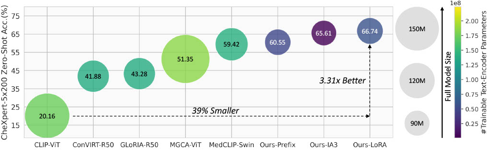

# CLEFT: Language-Image Contrastive Learning with Efficient Large Language Model and Prompt Fine-Tuning

##### Yuexi Du, Brian Chang, Nicha C. Dvornek
##### Yale University



This is the official implementation of paper ["CLEFT: Language-Image Contrastive Learning with Efficient Large Language Model and Prompt Fine-Tuning"](https://arxiv.org/abs/2407.21011) (Accepted by MICCAI 2024).

## Abstract

> Recent advancements in Contrastive Language-Image Pretraining (CLIP) [21] have demonstrated notable success in self-supervised representation learning across various tasks. However, the existing CLIP- like approaches often demand extensive GPU resources and prolonged training times due to the considerable size of the model and dataset, making them poor for medical applications, in which large datasets are not always common. Meanwhile, the language model prompts are mainly manually derived from labels tied to images, potentially overlooking the richness of information within training samples. We introduce a novel language-image Contrastive Learning method with an Efficient large language model and prompt Fine-Tuning (CLEFT) that harnesses the strengths of the extensive pre-trained language and visual models. Furthermore, we present an efficient strategy for learning context-based prompts that mitigates the gap between informative clinical diagnostic data and simple class labels. Our method demonstrates state-of-the-art performance on multiple chest X-ray and mammography datasets compared with various baselines. The proposed parameter efficient framework can reduce the total trainable model size by 39% and reduce the trainable language model to only 4% compared with the current BERT encoder.


### Environment

install with following steps:
```bash
conda env create -f environment.yml
pip install 'git+https://github.com/katsura-jp/pytorch-cosine-annealing-with-warmup'
```

You may need to manually install the `flash-attn` and `xformers` package if error encountered:
```bash
# Manually install flash attention
pip install flash-attn --no-build-isolation
# Manually install cosine annealing with warmup
# Manually install xformers
pip3 install -U xformers --index-url https://download.pytorch.org/whl/cu118
```

### Dataset

Our experiment mainly uses the following three datasets. Please also follow the paper to pre-process the images. In general, we resize the images to have a short side of `518` and rename it with suffix of `_resized`.

#### CheXpert-1.0

Download at [here](https://stanfordaimi.azurewebsites.net/datasets/8cbd9ed4-2eb9-4565-affc-111cf4f7ebe2).

#### RSNA Dataset

Download at [here](https://www.kaggle.com/c/rsna-pneumonia-detection-challenge).


#### EMBED Dataset

Acquire access from [here](https://aws.amazon.com/marketplace/pp/prodview-unw4li5rkivs2#resources)

#### Data Split

We provide the data split for the Chexpert dataset [here](https://drive.google.com/file/d/11pzNo-dRJKgp_lAVhW-AadHAX4jGI8kr/view?usp=sharing). We use the same data split for the RSNA dataset.

Note that we cannot share the data split for the EMBED dataset publicly as the access to this dataset needs approval. Please contact the [author](yuexi.du@yale.edu) once you have the access to the EMBED dataset, we will share the data split with you.

### Reproduce the experiment results:

We use `wandb` to log our experiment results, so you may want to configure your wandb first before reproduce the results.

To reproduce the results in the paper, you may follow the steps below:

#### Contrastive Pre-training

First, we do contrastive pre-training by running the following command:

```bash
python train.py  --batch_size 72 --learning_rate 4e-5 --experiment_name lora_linear_proj_learn_scale_pool_img_aug_swdcy --devices 4 --strategy 'ddp_find_unused_parameters_true' --llm_type gpt --precision bf16-true --peft lora --accumulate_grad_batches 1 --grad_ckpt --weight_decay 0.1 --warm_up 4000 --emb_dim 512 --max_steps 40000 --linear_proj --pool_feat
```
You may use different PEFT method by changing the `--peft` parameter.


#### Prompt Fine-tuning

You may then run the command below to conduct the context prompt fine-tuning.

```bash
python train.py  --batch_size 72 --learning_rate 1e-4  --experiment_name prompt_tuning_ft_vit_slr --devices 4 --strategy 'ddp_find_unused_parameters_true' --llm_type gpt --precision bf16-true --accumulate_grad_batches 1 --ctx_init caption --peft lora --max_steps 8000 --weight_decay 1e-3 --warm_up 100 --emb_dim 512 --linear_proj --pool_feat --pretrained_encoder <path_to_pretrained_ckpt> --grad_ckpt --min_lr 1e-5 --data_pct 1.0 --freeze_llm --sgd --prompt_ft --ctx_length 30
```

#### Model Evaluation

To evaluate the models, run
```bash
# CheXpert-5x200
python train.py  --batch_size 72 --learning_rate 4e-5 --experiment_name lora_linear_proj_learn_scale_pool_img_aug_swdcy --devices 4 --strategy 'ddp_find_unused_parameters_true' --llm_type gpt --precision bf16-true --peft lora --accumulate_grad_batches 1 --grad_ckpt --weight_decay 0.1 --warm_up 4000 --emb_dim 512 --max_steps 40000 --linear_proj --pool_feat --eval --five_cls --pretrained_model <path_to_pretrained_ckpt> 
# RSNA
python train.py  --batch_size 72 --learning_rate 4e-5 --experiment_name lora_linear_proj_learn_scale_pool_img_aug_swdcy --devices 4 --strategy 'ddp_find_unused_parameters_true' --llm_type gpt --precision bf16-true --peft lora --accumulate_grad_batches 1 --grad_ckpt --weight_decay 0.1 --warm_up 4000 --emb_dim 512 --max_steps 40000 --linear_proj --pool_feat --eval --five_cls --pretrained_model <path_to_pretrained_ckpt> --rsna 
```

### Pre-trained Checkpoints

We here provide the link to the LoRA pre-trained model in the paper below:

|Model|Link|
|:-:|:-:|
|Contrastive Pre-train|[Google Drive](https://drive.google.com/file/d/1LN8EGvnkP85XsTySgOZ0VCS5wQkZK60_/view?usp=sharing)|
|Prompt Fine-tune|[Google Drive](https://drive.google.com/file/d/1Df-EY26rS4-wg-Ip_PSPgRgfS0_issm5/view?usp=sharing)|


## Reference

```
@article{du2024sift,
  title={SIFT-DBT: Self-supervised Initialization and Fine-Tuning for Imbalanced Digital Breast Tomosynthesis Image Classification},
  author={Du, Yuexi and Hooley, Regina J and Lewin, John and Dvornek, Nicha C},
  journal={arXiv preprint arXiv:2403.13148},
  year={2024}
}
```